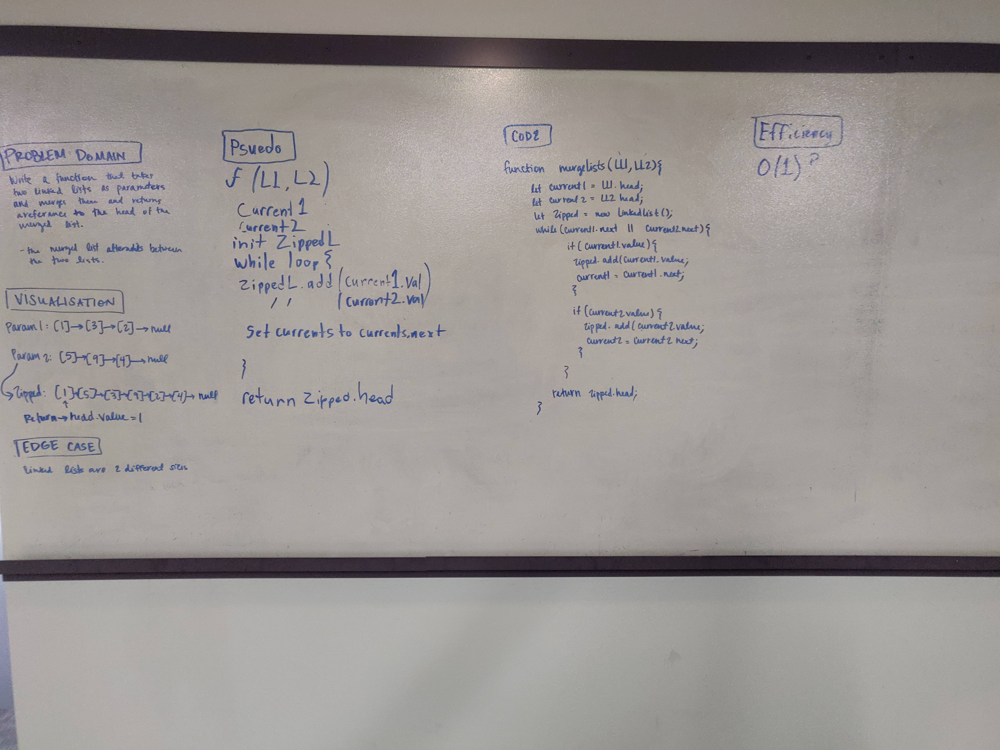

# Linked List Merge
<!-- Short summary or background information -->
A function that takes in 2 lists as parameters, combines them, then returns the head of the new list.

## Approach & Efficiency
We were able to do it all in 1 while loop, so it looks like 0(1)

## Solution
